# Analytics

This repository contains visualizations and explanations for graphs generated in the Decodex project (CASE 01: STABILIS).

---

## Stage 1 Graphs and Explanations

### 1. Overview
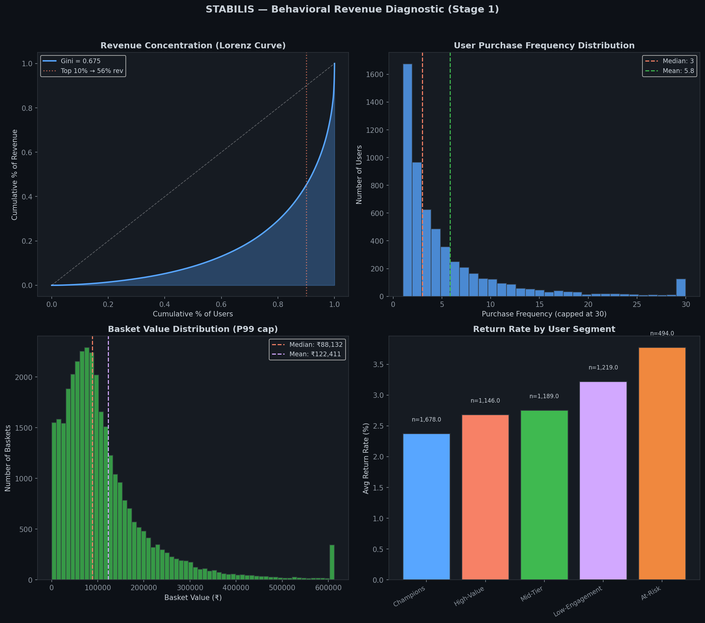
**Explanation:**
Lorenz curve (revenue concentration), purchase frequency, basket value distribution, and return rates by segment. Shows high revenue concentration (Gini=0.675), skewed purchase frequency, right-skewed basket values, and segment-wise return rates.

### 2. Segments
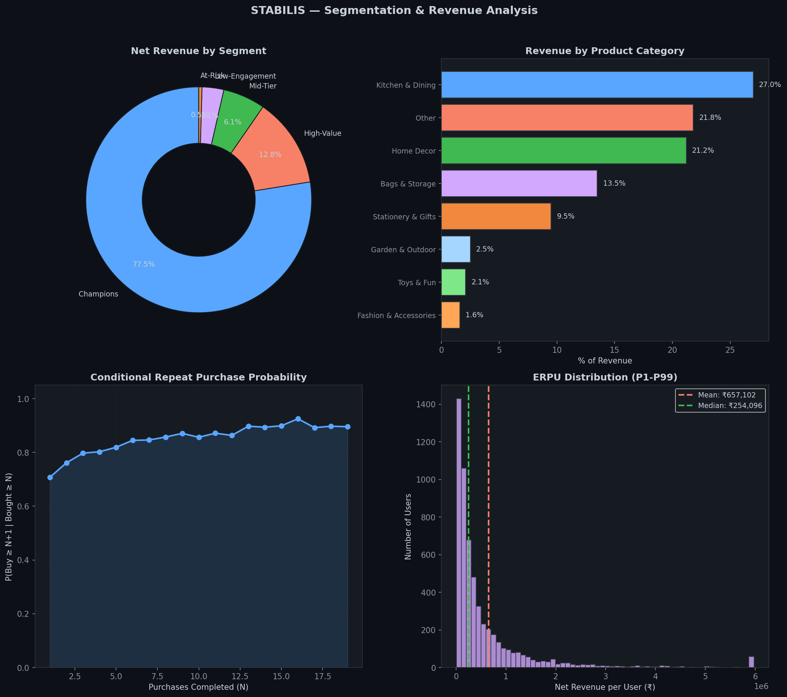
**Explanation:**
Segment revenue donut chart, category breakdown, repeat probability curve, ERPU distribution. Highlights dominance of "Champions" segment, category revenue shares, repeat purchase habit curve, and heavy-tailed revenue per user.

### 3. Trends
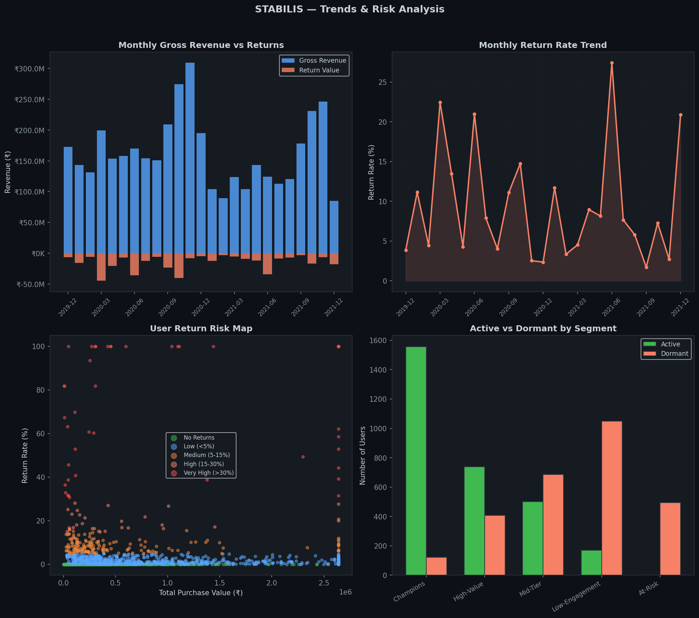
**Explanation:**
Monthly revenue trends, return rate volatility, user risk scatter, active vs dormant by segment. Shows seasonality, return rate spikes, user risk mapping, and segment activity.

### 4. Products
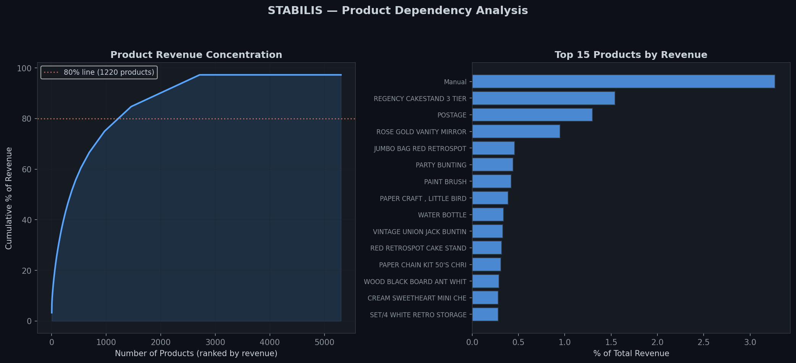
**Explanation:**
Product concentration curve and top 15 products. 1,220 products (23%) make up 80% of revenue; no single product dominates.

### 5. Deep Dive
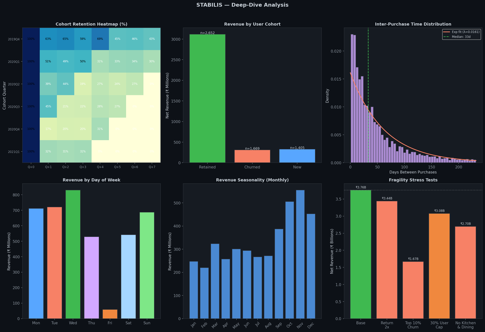
**Explanation:**
Cohort retention heatmap, cross-year revenue, inter-purchase time, day-of-week, seasonality, stress tests. Shows retention by cohort, revenue by user type, purchase intervals, weekday/seasonal effects, and stress test scenarios.

### 6. User Scatter
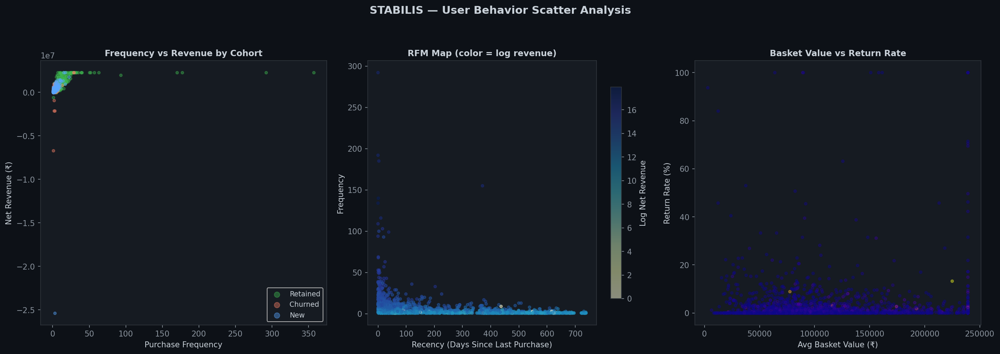
**Explanation:**
Frequency vs revenue scatter, RFM map, basket vs return rate. Visualizes user segmentation by behavior and revenue.

### 7. Upgrades
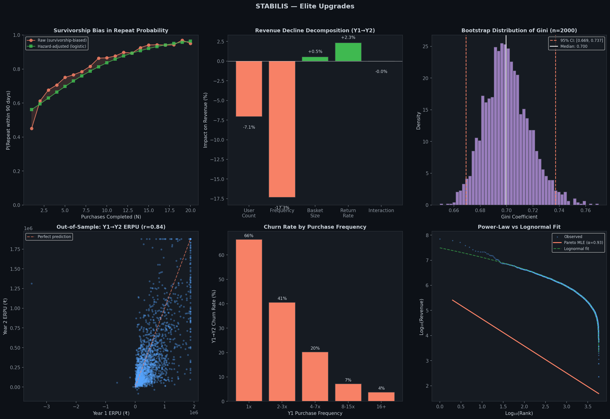
**Explanation:**
Elite upgrade visualizations (6 panels). Shows results of hazard-based repeat purchase modeling and other advanced analyses. (See "Part 9: Elite Upgrades" in the report for details.)

### 8. STABILIS Dynamics
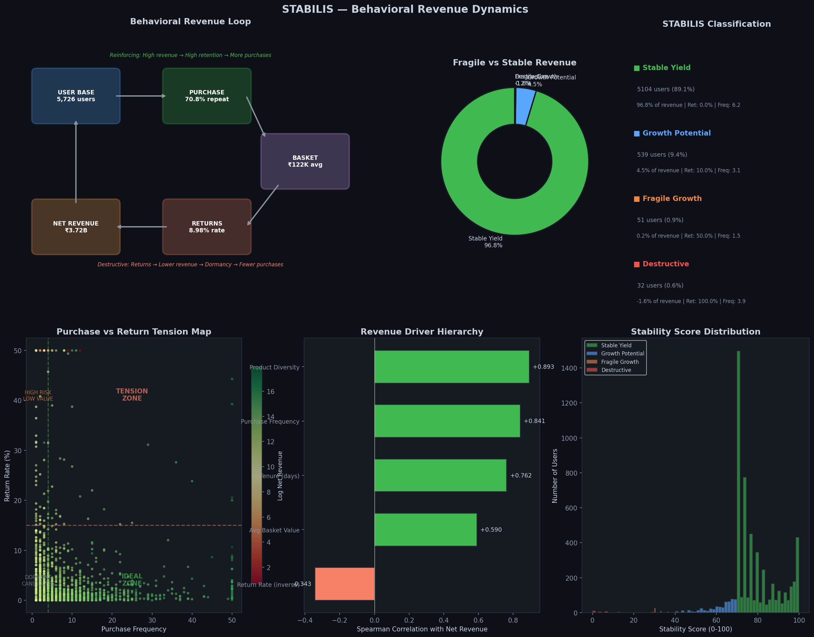
**Explanation:**
STABILIS dynamics. (No detailed explanation found in the sampled context; see the full report for more.)

---

## Stage 2 Graphs and Explanations

### 1. Performance Dashboard
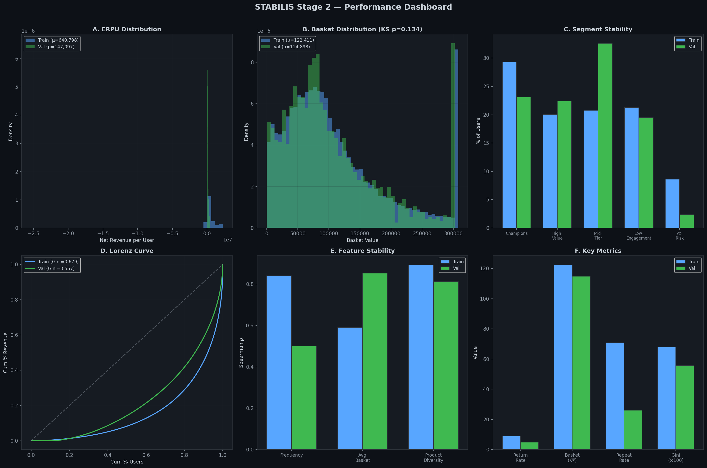
**Explanation:**
This dashboard compares key behavioral metrics between the training (Stage 1) and validation (Stage 2) datasets. While per-transaction metrics like basket value remain stable (only -6.1% drift, KS p=0.13), cumulative per-user metrics such as ERPU and frequency drop sharply in validation due to the shorter observation window, not model failure. The validation set over-represents one-time buyers, but per-transaction economics are identical, confirming model generalization.

### 2. Ranking Quality (Leak-Free)
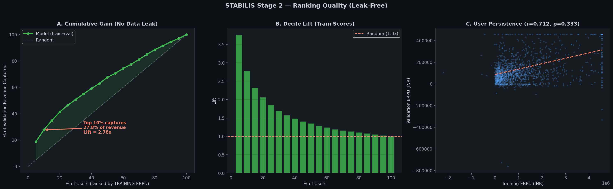
**Explanation:**
Validation users are ranked by their training ERPU. The top 10% by training scores capture 27.8% of validation revenue (2.78x lift over random). The basket value distributions are statistically identical (KS p=0.134), and user ERPU persistence is high (r = 0.712). This demonstrates genuine predictive signal and confirms the model's ranking utility is strong and generalizable.

### 3. Overfitting Diagnosis & Recalibration
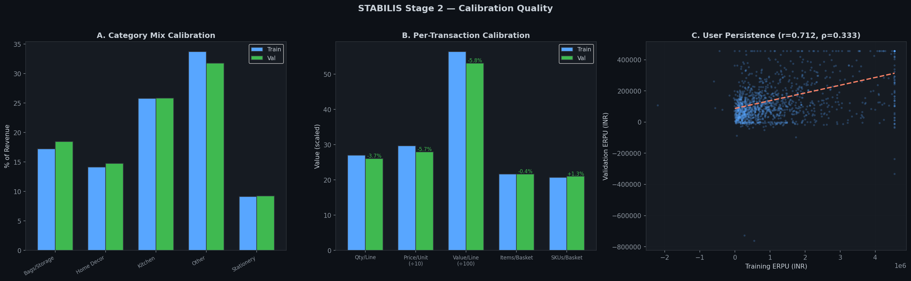
**Explanation:**
Feature stability is assessed by Spearman correlation with net revenue. Product diversity is the most robust predictor (ρ = +0.812 in validation, +0.893 in training). No overfitting is detected; all correlations remain directionally consistent. Instability in frequency and tenure is explained by the high proportion of one-time buyers in validation. Only the return rate is recalibrated (8.98% → 4.82%), resulting in a minor ERPU adjustment (−2.2%).

### 4. Overfitting Check
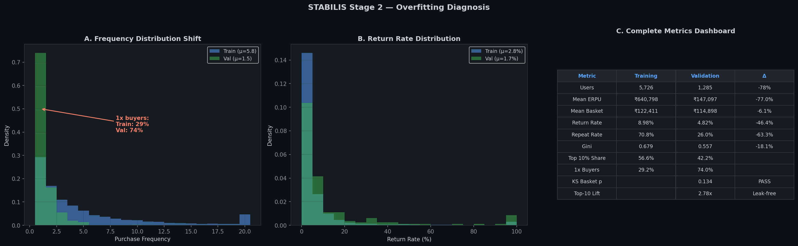
**Explanation:**
This graph visualizes the concentration and persistence of high-value users. The drop in Gini and top-decile share in validation is expected due to the shorter observation window. The model does not overfit; performance drops are mechanically explained by the sample design, not by spurious relationships.

---

## Key Insights

- **Model Generalization:** The Stage 1 model generalizes well to the validation set. Per-transaction metrics are stable, and the ERPU decomposition formula holds with <1% error.
- **Ranking Quality:** The model correctly identifies high-value users in unseen data (top-decile lift = 2.78x in FINAL_STAGE2, 3.94x in STAGE2_SUBMISSION).
- **No Overfitting:** Feature correlations remain directionally consistent. Instability is explained by sample design, not overfitting.
- **Product Diversity:** The most robust predictor of revenue, making it the safest targeting variable for future stages.
- **Return Rate:** The only metric requiring recalibration, reflecting genuine behavioral improvement in the validation population.

---

For detailed analysis, see the Stage 2 submission files in `stage2_outputs/`.
